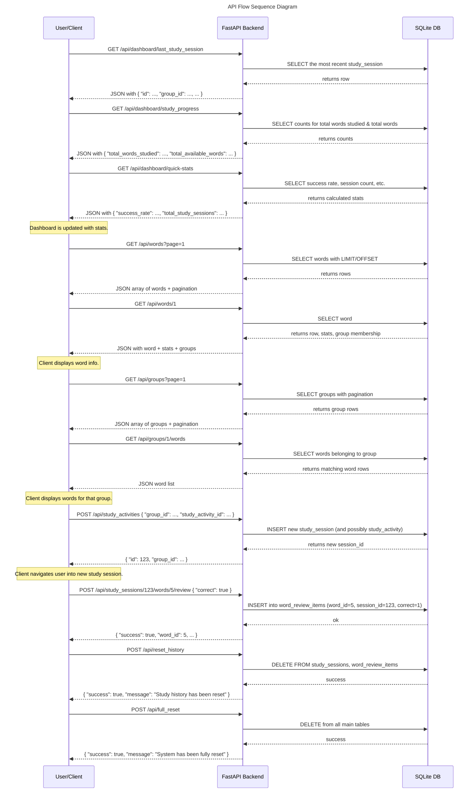

Below is a **Mermaid** file (`api_flow.mmd`) illustrating a **high-level API flow** using a **sequence diagram**. It covers a few core endpoints from client → backend → database, then back to the client with JSON responses. You can modify or expand this based on your exact workflow.

### How to Use

1. **Save** the above snippet to a file named `api_flow.mmd`.
2. **Render** it via your favorite Mermaid renderer or an online [Mermaid Live Editor](https://mermaid.live/).
3. **Extend** or **modify** the sequence diagram to show additional detail (e.g., error cases, authentication steps, etc.) if needed.