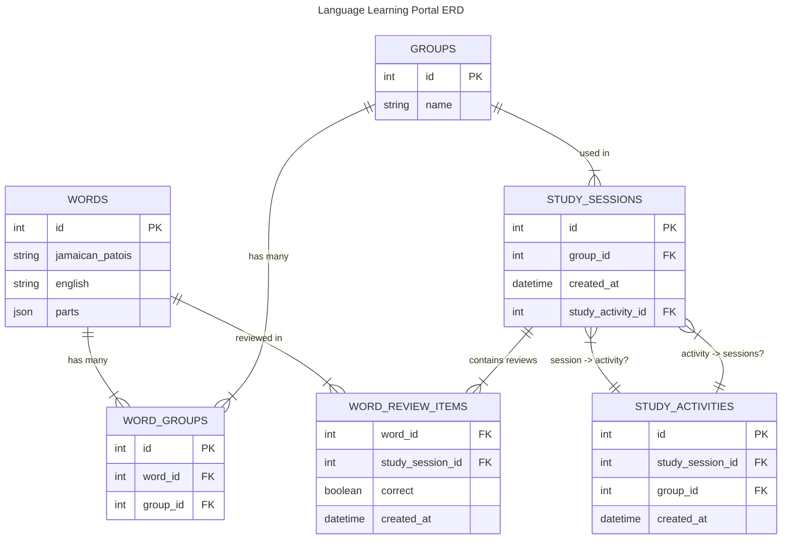

Below is a **Mermaid** file (`erd.mmd`) illustrating the **entity-relationship diagram (ERD)** for the described database schema. You can paste this into a `.mmd` file or into any Mermaid renderer to visualize it.

> **Note**: The relationship between `study_sessions` and `study_activities` in the spec is somewhat cyclical (`study_activity_id` on `study_sessions` but also `study_session_id` on `study_activities`). Below, we show it as two separate foreign keys with a note. You may refine this based on your actual logic (e.g., if it’s truly 1-to-1 or 1-to-many in practice).

### Notes

1. **Words ↔ Groups**: A **many-to-many** relationship is modeled via the **join table** `word_groups`.
2. **Study Sessions** ↔ `word_review_items`: One study session can have many word-review items (one row per review).
3. **Groups** ↔ `study_sessions`: A group can be used in many study sessions.
4. **Study Activities** ↔ `study_sessions`:  
   - The schema shows both `study_activity_id` in `study_sessions` and `study_session_id` in `study_activities`.  
   - This implies a **cyclical** or possibly **one-to-one** relationship. In real usage, you might refine or remove one of these foreign keys depending on your actual design.  

You can adjust the relationship lines (`||`, `|{`, `}o`, etc.) based on whether it’s strictly one-to-one or one-to-many in your final schema.