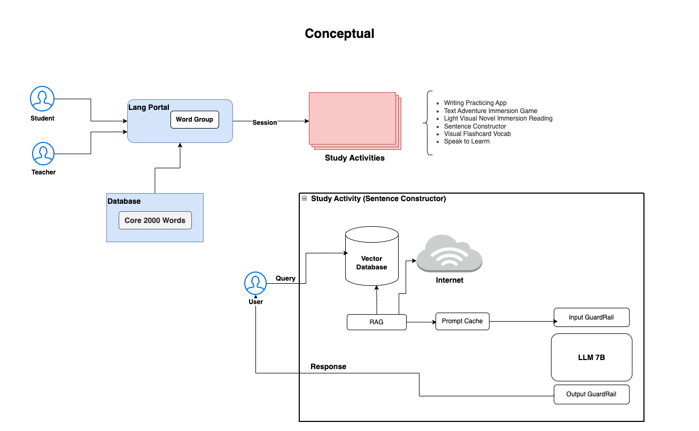

# GenAI Architecting: Conceptual Overview

This documentation provides an overview of the GenAI Architecting application, as depicted in the conceptual diagram. The application is designed to facilitate language learning through various study activities, leveraging AI-powered tools and a robust database.

## Overview

The application is structured to support both students and teachers in a language learning environment. It integrates a language portal, a database of core vocabulary, and a suite of study activities, including a Sentence Constructor powered by AI.

## Components

### 1. Lang Portal

- **Function:** Acts as the central hub for students and teachers to access language resources.
- **Features:** 
  - Word Group: Provides curated sets of vocabulary for targeted learning.
  - Session Management: Facilitates structured learning sessions.

### 2. Database

- **Core 2000 Words:** A comprehensive database containing essential vocabulary for language learning.
- **Integration:** The database feeds into the Lang Portal, ensuring that students have access to relevant vocabulary during their sessions.

### 3. Study Activities

The application offers a variety of study activities to enhance language learning:

- **Writing Practicing App:** Helps students improve their writing skills.
- **Text Adventure Immersion Game:** Engages students in interactive storytelling to practice language skills.
- **Light Visual Novel Immersion Reading:** Provides immersive reading experiences through visual novels.
- **Sentence Constructor:** Utilizes AI to assist students in constructing sentences in the target language.
- **Visual Flashcard Vocab:** Offers visual aids to reinforce vocabulary learning.
- **Speak to Learn:** Encourages verbal practice and pronunciation improvement.

### 4. Study Activity: Sentence Constructor

- **Vector Database:** Stores embeddings of vocabulary and sentence structures for efficient retrieval.
- **RAG (Retrieval-Augmented Generation):** Enhances sentence construction by combining retrieval-based and generation-based approaches.
- **Prompt Cache:** Stores frequently used prompts to optimize response times.
- **LLM 7B:** A large language model that processes user queries and generates responses.
- **Input/Output GuardRails:** Ensure that inputs and outputs are appropriate and relevant.

## Workflow

1. **User Interaction:**
   - Students and teachers interact with the Lang Portal to initiate learning sessions.
   - The portal accesses the Core 2000 Words database to provide relevant vocabulary.

2. **Study Activities:**
   - Users engage in various study activities, each designed to target specific language skills.
   - The Sentence Constructor uses AI to assist in sentence formation, leveraging the Vector Database and RAG framework.

3. **AI Processing:**
   - User queries are processed through the Sentence Constructor.
   - The system retrieves relevant data from the Vector Database and uses the LLM 7B model to generate responses.
   - Input and output are monitored by GuardRails to maintain quality and relevance.

4. **Feedback and Improvement:**
   - The application continuously learns from user interactions to improve its offerings.
   - Future plans include exploring open-source models to enhance the AI capabilities further.

## Conclusion

The GenAI Architecting application provides a comprehensive and interactive platform for language learning. By integrating AI-powered tools and a robust database, it offers a dynamic and engaging learning experience for students and teachers alike.
