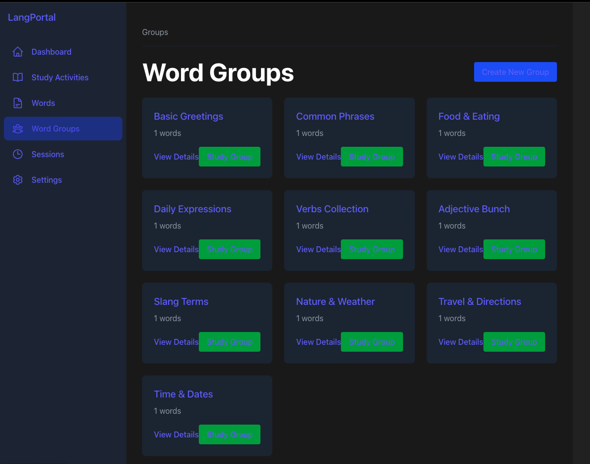
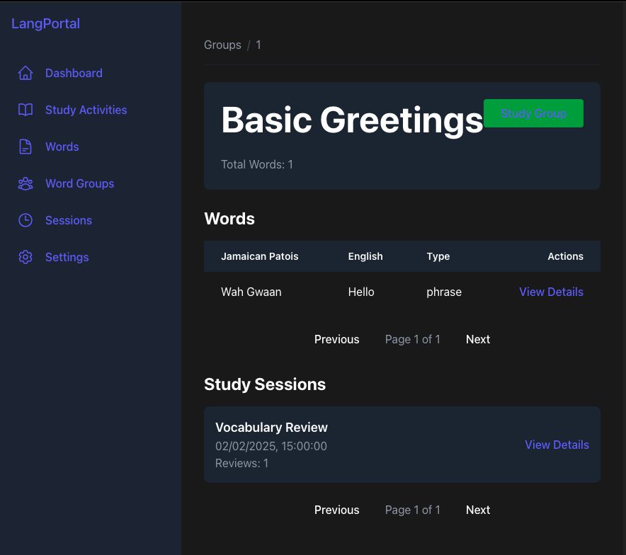
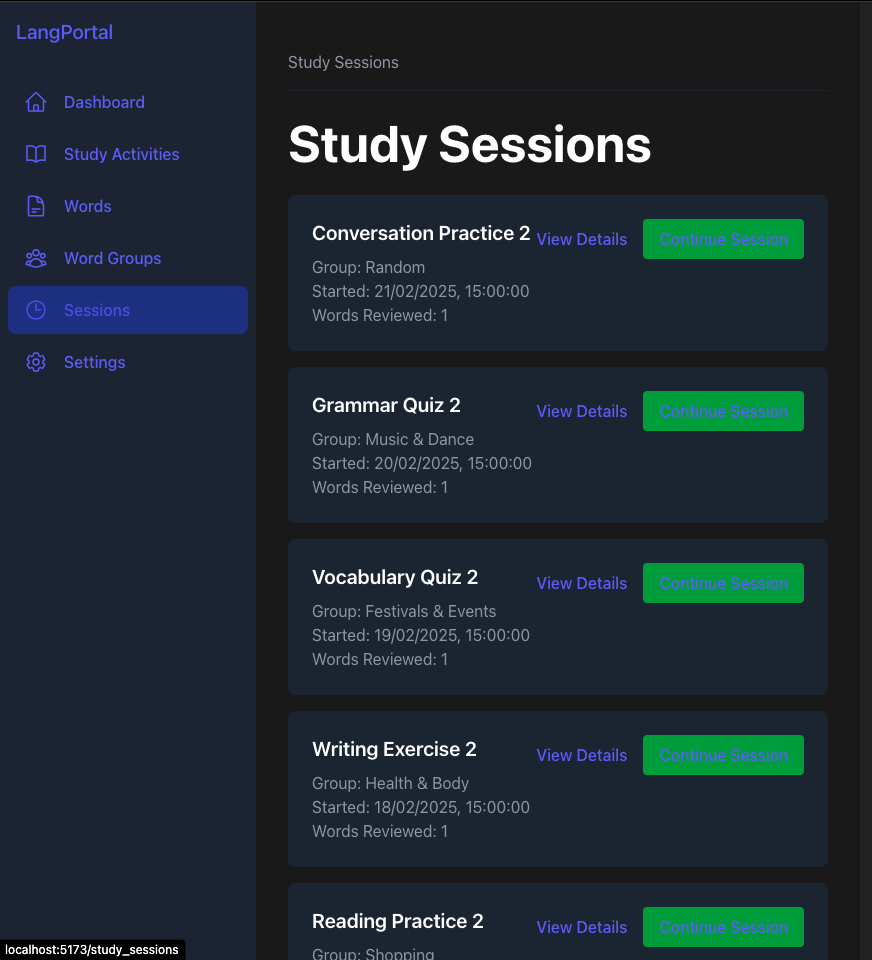
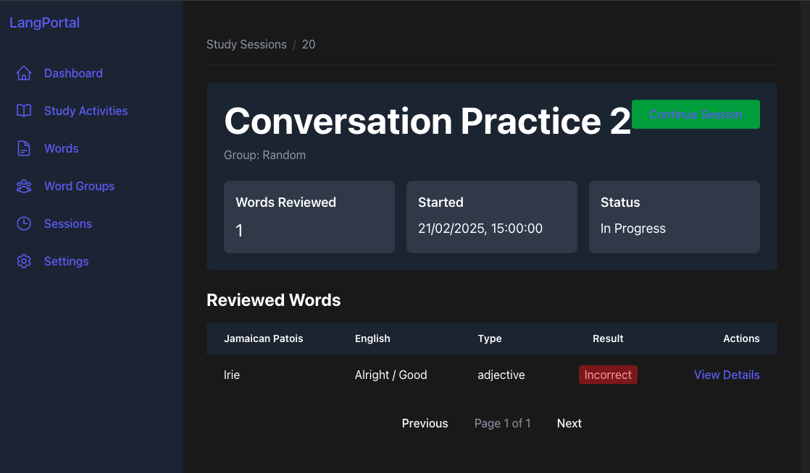
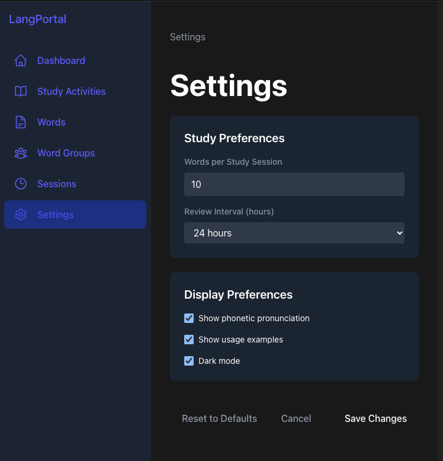
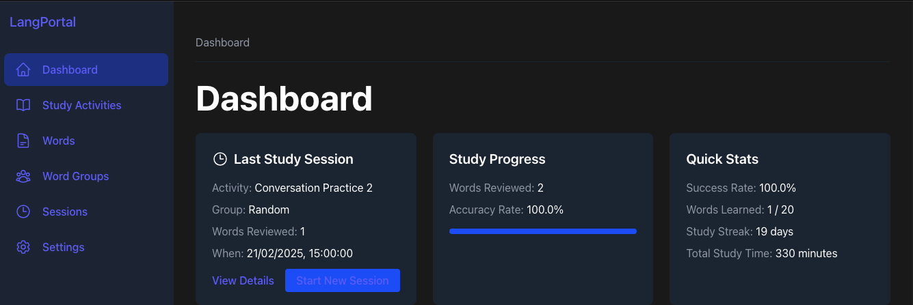
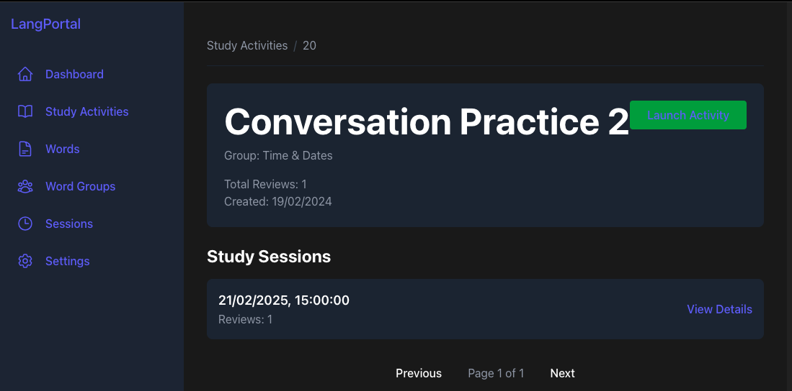
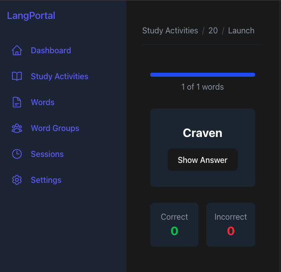
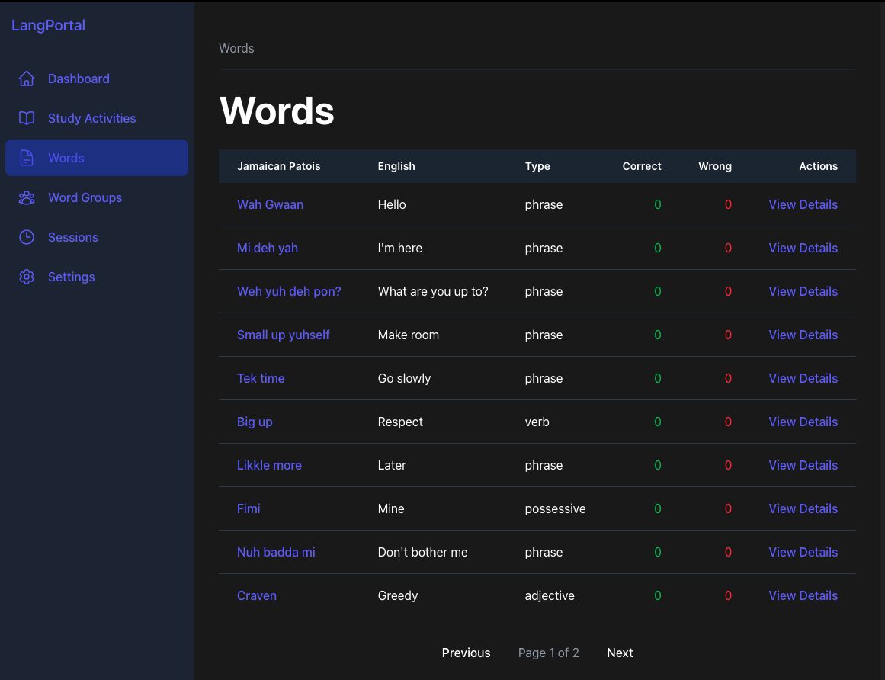
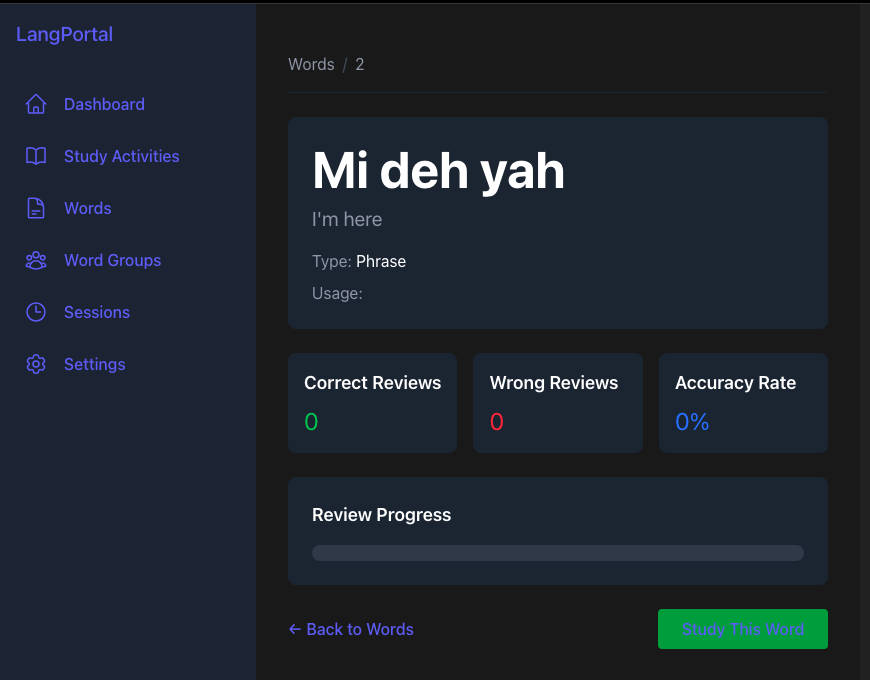

# Lang Portal Frontend

Frontend application for the Language Learning Portal built with React, TypeScript, Tailwind CSS, and Vite.

## Project Setup Progress

### 1. Project Initialization ✅

- [x] Create new Vite + React + TypeScript project
- [x] Install Tailwind CSS
- [x] Configure Tailwind CSS
- [x] Add Tailwind directives
- [x] Verify setup works
- [x] Install additional packages

### 2. Global Setup (Layout, Router, Tailwind) ✅

- [x] Set up BrowserRouter in main.tsx
- [x] Define routes in App.tsx
- [x] Create global Layout component
- [x] Create common components (Header, Footer)

### 3. Dashboard Page (`/dashboard`) ✅

- [x] Set up API service
- [x] Create dashboard types
- [x] Implement LastSessionCard component
- [x] Create Dashboard page with:
  - Last Study Session
  - Study Progress
  - Quick Stats
- [x] Add loading states
- [x] Style with Tailwind CSS

### 4. Study Activities Index (`/study_activities`) ✅

- [x] Create StudyActivity types
- [x] Implement ActivityCard component
- [x] Create StudyActivitiesIndex page with:
  - Loading states
  - Error handling
  - Empty state
  - Grid layout for activities
- [x] Add "Create New Activity" functionality

### 5. Study Activity Show (`/study_activities/:id`) ✅

- [x] Create StudySession type
- [x] Implement StudyActivityShow page with:
  - Activity details header
  - Study sessions list with pagination
  - Loading states
  - Error handling
- [x] Add navigation to launch activity or view session details

### 6. Study Activity Launch (`/study_activities/:id/launch`) ✅

- [x] Create ReviewWord interface extending Word type
- [x] Implement StudyActivityLaunch page with:
  - Progress tracking
  - Word review interface
  - Review submission
  - Session completion handling
- [x] Add loading and error states

### 7. Words Index (`/words`) ✅

- [x] Create paginated words table
- [x] Add word type and review count columns
- [x] Implement pagination controls
- [x] Add loading and error states

### 8. Word Show (`/words/:id`) ✅

- [x] Create detailed word view with:
  - Translation display
  - Word type and usage information
  - Review statistics
  - Progress visualization
- [x] Add loading and error states
- [x] Implement "Study This Word" functionality

### 9. Word Groups Index (`/groups`) ✅

- [x] Create paginated groups grid
- [x] Display group details (name, word count, description)
- [x] Add quick actions (View Details, Study Group)
- [x] Implement pagination controls
- [x] Add loading and error states

## Word Groups Index Implementation

The Word Groups Index page displays a grid of word groups with their details and quick actions.



### Features

- **Groups Grid Layout**
  - Group name and word count
  - Optional description
  - Quick action buttons
  - Responsive grid (1 column on mobile, 2 on tablet, 3 on desktop)

- **Quick Actions**
  - View group details
  - Start studying group
  - Create new group

### Components

#### Group Card
```tsx
<div className="bg-gray-800 rounded-lg p-6">
  <Link to={`/groups/${group.id}`} className="text-xl font-semibold">
    {group.name}
  </Link>
  <p className="text-gray-400 mt-2">
    {group.word_count} words
  </p>
  {group.description && (
    <p className="text-gray-500 mt-2 text-sm">
      {group.description}
    </p>
  )}
  <div className="mt-4 flex justify-between items-center">
    <Link to={`/groups/${group.id}`}>View Details</Link>
    <Link to={`/study_activities/new?group=${group.id}`}>
      Study Group
    </Link>
  </div>
</div>
```

### API Integration

The page fetches paginated groups data from:
```typescript
GET /api/groups?page={page}&page_size=10
```

Response type:
```typescript
interface PaginatedGroups {
  groups: Group[];
  pagination: {
    current_page: number;
    total_pages: number;
    total_items: number;
    items_per_page: number;
  };
}

interface Group {
  id: number;
  name: string;
  word_count: number;
  description: string | null;
}
```

### Usage

Navigate to `/groups` to:
- View all word groups
- See group details and word counts
- Start studying a group
- Create new groups
- Navigate to detailed group views

The page supports:
- Loading states with skeleton UI
- Error handling with retry option
- Pagination controls
- Responsive grid layout

### 10. Group Show (`/groups/:id`) ✅

- [x] Create detailed group view with:
  - Group details header
  - Paginated words table
  - Study sessions history
- [x] Add loading and error states
- [x] Implement pagination for both words and sessions
- [x] Add "Study Group" functionality

## Group Show Implementation

The Group Show page displays detailed information about a word group, including its words and study history.



### Features

- **Group Details Header**
  - Group name and description
  - Total word count
  - Quick action to start studying

- **Words Table**
  - Paginated list of words in the group
  - Word translations and types
  - Links to word details
  - Separate pagination controls

- **Study Sessions History**
  - List of past study sessions
  - Session details and review counts
  - Links to session details
  - Independent pagination

### Components

#### Group Header
```tsx
<div className="bg-gray-800 rounded-lg p-6">
  <div className="flex justify-between items-start mb-4">
    <div>
      <h1 className="text-3xl font-bold mb-2">{group.name}</h1>
      {group.description && (
        <p className="text-gray-400">{group.description}</p>
      )}
    </div>
    <Link
      to={`/study_activities/new?group=${group.id}`}
      className="bg-green-600 text-white px-6 py-2 rounded"
    >
      Study Group
    </Link>
  </div>
  <p className="text-gray-400">
    Total Words: {group.word_count}
  </p>
</div>
```

#### Words Table
```tsx
<table className="w-full">
  <thead className="bg-gray-800">
    <tr>
      <th>Jamaican Patois</th>
      <th>English</th>
      <th>Type</th>
      <th>Actions</th>
    </tr>
  </thead>
  <tbody>
    {words.map(word => (
      <tr key={word.id}>
        <td>{word.jamaican_patois}</td>
        <td>{word.english}</td>
        <td>{word.parts?.type || '-'}</td>
        <td>
          <Link to={`/words/${word.id}`}>
            View Details
          </Link>
        </td>
      </tr>
    ))}
  </tbody>
</table>
```

### API Integration

The page interacts with three endpoints:

1. Group Details:
```typescript
GET /api/groups/:id
```

2. Group Words:
```typescript
GET /api/groups/:id/words?page={page}
```

3. Group Study Sessions:
```typescript
GET /api/groups/:id/study_sessions?page={page}
```

Response types:
```typescript
interface Group {
  id: number;
  name: string;
  word_count: number;
  description: string | null;
}

interface PaginatedWords {
  words: Word[];
  pagination: {
    current_page: number;
    total_pages: number;
    total_items: number;
    items_per_page: number;
  };
}

interface PaginatedSessions {
  study_sessions: StudySession[];
  pagination: {
    current_page: number;
    total_pages: number;
    total_items: number;
    items_per_page: number;
  };
}
```

### Usage

Navigate to `/groups/:id` to:
- View group details and statistics
- Browse words in the group
- See study session history
- Start studying the group
- Navigate to word details

The page supports:
- Loading states with skeleton UI
- Error handling with retry option
- Independent pagination for words and sessions
- Responsive layout

### 11. Study Sessions Index (`/study_sessions`) ✅

- [x] Create paginated list of study sessions
- [x] Display session details (activity name, group, timing, review count)
- [x] Add quick actions (View Details, Continue Session)
- [x] Implement pagination controls
- [x] Add loading and error states

## Study Sessions Index Implementation

The Study Sessions Index page displays a chronological list of study sessions with their details and actions.



### Features

- **Session Cards**
  - Activity and group names
  - Session start time
  - Review count
  - Quick action buttons
  - Continue option for incomplete sessions

- **Empty State**
  - Friendly message for new users
  - Call-to-action to start first session

### Components

#### Session Card
```tsx
<div className="bg-gray-800 rounded-lg p-6">
  <div className="flex justify-between items-start">
    <div>
      <h2 className="text-xl font-semibold mb-2">
        {session.activity_name}
      </h2>
      <p className="text-gray-400">
        Group: {session.group_name}
      </p>
      <p className="text-gray-400">
        Started: {new Date(session.start_time).toLocaleString()}
      </p>
      <p className="text-gray-400">
        Words Reviewed: {session.review_items_count}
      </p>
    </div>
    <div className="flex items-center space-x-4">
      <Link to={`/study_sessions/${session.id}`}>
        View Details
      </Link>
      {!session.end_time && (
        <Link to={`/study_activities/${session.id}/launch`}>
          Continue Session
        </Link>
      )}
    </div>
  </div>
</div>
```

### API Integration

The page fetches paginated sessions data from:
```typescript
GET /api/study_sessions?page={page}&page_size=10
```

Response type:
```typescript
interface PaginatedSessions {
  study_sessions: StudySession[];
  pagination: {
    current_page: number;
    total_pages: number;
    total_items: number;
    items_per_page: number;
  };
}

interface StudySession {
  id: number;
  activity_name: string;
  group_name: string;
  start_time: string;
  end_time: string | null;
  review_items_count: number;
}
```

### Usage

Navigate to `/study_sessions` to:
- View all study sessions
- See session details and progress
- Continue incomplete sessions
- Navigate to detailed session views
- Start new study sessions

The page supports:
- Loading states with skeleton UI
- Error handling with retry option
- Empty state with call-to-action
- Pagination controls
- Responsive layout

### 12. Study Session Show (`/study_sessions/:id`) ✅

- [x] Create detailed session view with:
  - Session details header
  - Session statistics
  - Paginated words table with review results
- [x] Add loading and error states
- [x] Implement pagination for reviewed words
- [x] Add "Continue Session" functionality for incomplete sessions

## Study Session Show Implementation

The Study Session Show page displays detailed information about a specific study session, including statistics and reviewed words.



### Features

- **Session Header**
  - Activity and group names
  - Continue button for incomplete sessions
  - Session statistics

- **Session Stats**
  - Words reviewed count
  - Start time
  - Duration or status
  - Visual stats cards

- **Reviewed Words Table**
  - Word translations and types
  - Review results with visual indicators
  - Links to word details
  - Pagination controls

### Components

#### Session Stats Grid
```tsx
<div className="grid grid-cols-1 md:grid-cols-3 gap-4 mt-6">
  <div className="bg-gray-700 rounded-lg p-4">
    <h3 className="text-lg font-semibold mb-2">Words Reviewed</h3>
    <p className="text-2xl">{session.review_items_count}</p>
  </div>
  
  <div className="bg-gray-700 rounded-lg p-4">
    <h3 className="text-lg font-semibold mb-2">Started</h3>
    <p className="text-lg">
      {new Date(session.start_time).toLocaleString()}
    </p>
  </div>
  
  <div className="bg-gray-700 rounded-lg p-4">
    <h3 className="text-lg font-semibold mb-2">
      {session.end_time ? 'Duration' : 'Status'}
    </h3>
    <p className="text-lg">
      {session.end_time 
        ? `${duration} minutes`
        : 'In Progress'
      }
    </p>
  </div>
</div>
```

#### Words Table Row
```tsx
<tr className="hover:bg-gray-800">
  <td>{word.jamaican_patois}</td>
  <td>{word.english}</td>
  <td>{word.parts?.type || '-'}</td>
  <td className="text-center">
    <span className={`px-2 py-1 rounded ${
      word.correct_count > word.wrong_count
        ? 'bg-green-900 text-green-300'
        : 'bg-red-900 text-red-300'
    }`}>
      {word.correct_count > word.wrong_count ? 'Correct' : 'Incorrect'}
    </span>
  </td>
  <td className="text-right">
    <Link to={`/words/${word.id}`}>
      View Details
    </Link>
  </td>
</tr>
```

### API Integration

The page interacts with two endpoints:

1. Session Details:
```typescript
GET /api/study_sessions/:id
```

2. Session Words:
```typescript
GET /api/study_sessions/:id/words?page={page}
```

Response types:
```typescript
interface StudySession {
  id: number;
  activity_name: string;
  group_name: string;
  start_time: string;
  end_time: string | null;
  review_items_count: number;
}

interface PaginatedWords {
  words: Word[];
  pagination: {
    current_page: number;
    total_pages: number;
    total_items: number;
    items_per_page: number;
  };
}
```

### Usage

Navigate to `/study_sessions/:id` to:
- View session details and statistics
- See reviewed words and their results
- Continue incomplete sessions
- Navigate to word details

The page supports:
- Loading states with skeleton UI
- Error handling with retry option
- Pagination for reviewed words
- Responsive layout
- Session duration calculation

### 13. Settings Page (`/settings`) ✅

- [x] Create settings form with:
  - Study preferences (words per session, review interval)
  - Display preferences (phonetics, usage examples, dark mode)
- [x] Add form validation
- [x] Implement save and reset functionality
- [x] Add success/error states

## Settings Page Implementation

The Settings page allows users to customize their learning experience and interface preferences.



### Features

- **Study Preferences**
  - Words per study session (1-50)
  - Review interval selection (12-72 hours)
  - Form validation

- **Display Preferences**
  - Phonetic pronunciation toggle
  - Usage examples toggle
  - Dark mode toggle

- **Actions**
  - Save changes
  - Reset to defaults
  - Cancel changes

### Components

#### Study Preferences Form
```tsx
<div className="bg-gray-800 rounded-lg p-6">
  <h2 className="text-xl font-semibold mb-4">Study Preferences</h2>
  <div className="space-y-4">
    <div>
      <label className="block text-sm font-medium text-gray-400 mb-2">
        Words per Study Session
      </label>
      <input
        type="number"
        name="wordsPerSession"
        min="1"
        max="50"
        value={preferences.wordsPerSession}
        onChange={handleChange}
        className="bg-gray-700 rounded px-3 py-2 w-full"
      />
    </div>
  </div>
</div>
```

### API Integration

The page interacts with these endpoints:

1. Get user preferences:
```typescript
GET /api/settings
```

2. Update preferences:
```typescript
POST /api/settings
```

Types:
```typescript
interface LearningPreferences {
  wordsPerSession: number;
  reviewInterval: number;
  showPhonetics: boolean;
  showUsageExamples: boolean;
  darkMode: boolean;
}
```

### Usage

Navigate to `/settings` to:
- Configure study preferences
- Customize display options
- Save or reset preferences
- Return to previous page

The page supports:
- Form validation
- Success/error messages
- Reset to defaults
- Responsive layout

### 14. Testing and Final Review 🔄

## Setup Steps Completed

1. Created new Vite project with React and TypeScript
2. Installed Tailwind CSS v4 and its dependencies:
   ```bash
   npm install tailwindcss @tailwindcss/vite
   ```
3. Configured Vite for Tailwind CSS:
   - Updated vite.config.ts to include Tailwind plugin
   - Added Tailwind import to src/index.css
4. Installed additional required packages:
   ```bash
   npm install react-router-dom axios
   ```
5. Setting up Global Layout and Routing:
   - Created Layout component with Header and Footer
   - Configured BrowserRouter in main.tsx
   - Set up route structure in App.tsx
   - Created placeholder components for all pages
6. Implemented Dashboard Page:
   - Created API service for backend communication
   - Added TypeScript interfaces for type safety
   - Built responsive dashboard layout with 3 main cards
   - Implemented loading states and error handling
   - Added navigation to other sections

## Dashboard Implementation

The dashboard consists of three main components:



### Last Study Session Card
Shows information about the most recent study session including:
- Activity name
- Group name
- Number of words reviewed
- Session timestamp
- Links to view details or start a new session


### Study Progress Card
Displays overall study progress including:
- Total words reviewed
- Accuracy rate with progress bar
- Words by group statistics


### Quick Stats Card
Shows key statistics including:
- Success rate
- Words learned vs total words
- Study streak
- Total study time


## Study Activities Index Implementation

The Study Activities Index page displays a collection of study activities and allows users to view details or launch activities.


### Features

- **Grid Layout**: Responsive grid showing activity cards (1 column on mobile, 2 on tablet, 3 on desktop)
- **Loading State**: Skeleton loading animation while fetching data
- **Error Handling**: User-friendly error message with retry option
- **Empty State**: Special UI when no activities exist
- **Create New**: Button to create new activities

### Components

#### ActivityCard
Displays individual study activities with:
- Activity name
- Associated group
- Review count
- View and Launch actions

```typescript
interface ActivityCardProps {
  activity: StudyActivity;
}
```

#### Loading State
Shows skeleton loading animation while data is being fetched:
```tsx
{[...Array(3)].map((_, i) => (
  <div key={i} className="bg-gray-800 rounded-lg p-6 animate-pulse">
    <div className="h-4 bg-gray-700 rounded w-3/4 mb-4"></div>
    <div className="h-4 bg-gray-700 rounded w-1/2"></div>
  </div>
))}
```

### API Integration

The page fetches study activities from:
```typescript
GET /api/study_activities
```

Response type:
```typescript
interface StudyActivity {
  id: number;
  name: string;
  study_session_id: number | null;
  group_id: number;
  created_at: string;
  group_name: string;
  review_items_count: number;
}
```

### Component Structure

```
src/
├── components/
│   ├── dashboard/
│   │   └── LastSessionCard.tsx
│   ├── Layout.tsx
│   ├── Header.tsx
│   └── Sidebar.tsx
├── pages/
│   └── Dashboard.tsx
├── services/
│   └── api.ts
└── types/
    └── dashboard.ts
```

### Usage

Navigate to `/study_activities` to:
- View all study activities
- Create new activities
- Launch or view details of existing activities

The page supports:
- Loading states for better UX
- Error handling with retry option
- Empty state with call-to-action
- Responsive grid layout

## Study Activity Show Implementation

The Study Activity Show page displays detailed information about a specific study activity and its associated study sessions.



### Features

- **Activity Details Header**
  - Activity name and group
  - Total review count
  - Creation date
  - Launch activity button

- **Study Sessions List**
  - Paginated list of all sessions
  - Session timestamp and review count
  - Link to session details
  - Empty state handling

### Components

#### Activity Header
```tsx
<div className="bg-gray-800 rounded-lg p-6">
  <div className="flex justify-between items-start">
    <div>
      <h1 className="text-3xl font-bold">{activity.name}</h1>
      <p className="text-gray-400">Group: {activity.group_name}</p>
    </div>
    <Link to={`/study_activities/${id}/launch`}>
      Launch Activity
    </Link>
  </div>
</div>
```

#### Session List Item
```tsx
<div className="bg-gray-800 rounded-lg p-4">
  <div className="flex justify-between items-center">
    <div>
      <p className="text-lg font-semibold">
        {new Date(session.start_time).toLocaleString()}
      </p>
      <p className="text-gray-400">
        Reviews: {session.review_items_count}
      </p>
    </div>
    <Link to={`/study_sessions/${session.id}`}>
      View Details
    </Link>
  </div>
</div>
```

### API Integration

The page fetches data from two endpoints:

1. Activity Details:
```typescript
GET /api/study_activities/:id
```

2. Study Sessions:
```typescript
GET /api/study_activities/:id/study_sessions?page={page}
```

Response types:
```typescript
interface StudySession {
  id: number;
  activity_name: string;
  group_name: string;
  start_time: string;
  end_time: string | null;
  review_items_count: number;
}

interface PaginatedSessions {
  study_sessions: StudySession[];
  pagination: {
    current_page: number;
    total_pages: number;
    total_items: number;
    items_per_page: number;
  };
}
```

### Component Structure

```
src/
├── pages/
│   └── StudyActivityShow.tsx
└── types/
    ├── studyActivities.ts
    └── studySessions.ts
```

### Usage

Navigate to `/study_activities/:id` to:
- View activity details
- See all study sessions for the activity
- Launch new study sessions
- Navigate to individual session details

The page supports:
- Loading states with skeleton UI
- Error handling with retry option
- Pagination for study sessions
- Responsive layout

## Study Activity Launch Implementation

The Study Activity Launch page provides an interactive interface for reviewing words.



### Features

- **Progress Tracking**
  - Visual progress bar
  - Word count indicator
  - Current session statistics

- **Word Review Interface**
  - Shows Jamaican Patois word
  - "Show Answer" button reveals English translation
  - Correct/Incorrect response buttons
  - Review submission to backend

### Components

#### Progress Bar
```tsx
<div className="bg-gray-700 rounded-full h-2">
  <div 
    className="bg-blue-600 rounded-full h-2 transition-all duration-300"
    style={{ width: `${progress}%` }}
  ></div>
</div>
```

#### Word Card
```tsx
<div className="bg-gray-800 rounded-lg p-8 text-center">
  <h2 className="text-2xl font-bold mb-4">{currentWord.jamaican_patois}</h2>
  {showAnswer ? (
    <>
      <p className="text-xl text-gray-300 mb-8">{currentWord.english}</p>
      <div className="flex justify-center gap-4">
        <button onClick={() => handleReview(false)}>Incorrect</button>
        <button onClick={() => handleReview(true)}>Correct</button>
      </div>
    </>
  ) : (
    <button onClick={() => setShowAnswer(true)}>Show Answer</button>
  )}
</div>
```

### API Integration

The page interacts with two endpoints:

1. Fetch activity words:
```typescript
GET /api/study_activities/:id/words
```

2. Submit word review:
```typescript
POST /api/study_sessions/:session_id/words/:word_id/review
```

### Usage

Navigate to `/study_activities/:id/launch` to:
- Start a new study session
- Review words one by one
- Track progress and performance
- Complete the session

The page supports:
- Loading states with spinner
- Error handling with retry option
- Session progress tracking
- Automatic navigation on completion

## Words Index Implementation

The Words Index page displays a paginated table of all words with their translations and statistics.



### Features

- **Words Table**
  - Jamaican Patois and English translations
  - Word type information
  - Correct/Wrong review counts
  - Links to word details

- **Pagination**
  - Page size of 10 words
  - Previous/Next navigation
  - Current page indicator

### Components

#### Words Table
```tsx
<table className="w-full">
  <thead className="bg-gray-800">
    <tr>
      <th>Jamaican Patois</th>
      <th>English</th>
      <th>Type</th>
      <th>Correct</th>
      <th>Wrong</th>
      <th>Actions</th>
    </tr>
  </thead>
  <tbody>
    {words.map(word => (
      <tr key={word.id}>
        <td>{word.jamaican_patois}</td>
        <td>{word.english}</td>
        <td>{word.parts?.type}</td>
        <td>{word.correct_count}</td>
        <td>{word.wrong_count}</td>
        <td>
          <Link to={`/words/${word.id}`}>View Details</Link>
        </td>
      </tr>
    ))}
  </tbody>
</table>
```

### API Integration

The page fetches paginated words data from:
```typescript
GET /api/words?page={page}&page_size=10
```

Response type:
```typescript
interface PaginatedResponse {
  words: Word[];
  pagination: {
    current_page: number;
    total_pages: number;
    total_items: number;
    items_per_page: number;
  };
}
```

### Usage

Navigate to `/words` to:
- View all words in the system
- See translations and statistics
- Navigate to word details
- Browse through pages of words

The page supports:
- Loading states with skeleton UI
- Error handling with retry option
- Responsive table layout
- Pagination controls

## Word Show Implementation

The Word Show page displays detailed information about a specific word, including its translation, usage details, and review statistics.



### Features

- **Word Details**
  - Jamaican Patois word
  - English translation
  - Word type and usage information
  - Review statistics

- **Statistics Display**
  - Correct reviews count
  - Wrong reviews count
  - Accuracy rate
  - Visual progress bar

### Components

#### Word Header
```tsx
<div className="bg-gray-800 rounded-lg p-6">
  <div className="mb-4">
    <h1 className="text-3xl font-bold mb-2">{word.jamaican_patois}</h1>
    <p className="text-xl text-gray-400">{word.english}</p>
  </div>
  
  {word.parts && (
    <div className="mt-4 space-y-2">
      <p>
        <span className="text-gray-400">Type:</span>{' '}
        <span className="capitalize">{word.parts.type}</span>
      </p>
      <p>
        <span className="text-gray-400">Usage:</span>{' '}
        <span className="capitalize">{word.parts.usage}</span>
      </p>
    </div>
  )}
</div>
```

#### Statistics Grid
```tsx
<div className="grid grid-cols-1 md:grid-cols-3 gap-4">
  <div className="bg-gray-800 rounded-lg p-4">
    <h3 className="text-lg font-semibold mb-2">Correct Reviews</h3>
    <p className="text-2xl text-green-500">{word.correct_count}</p>
  </div>
  
  <div className="bg-gray-800 rounded-lg p-4">
    <h3 className="text-lg font-semibold mb-2">Wrong Reviews</h3>
    <p className="text-2xl text-red-500">{word.wrong_count}</p>
  </div>
  
  <div className="bg-gray-800 rounded-lg p-4">
    <h3 className="text-lg font-semibold mb-2">Accuracy Rate</h3>
    <p className="text-2xl text-blue-500">{accuracy}%</p>
  </div>
</div>
```

### API Integration

The page fetches word data from:
```typescript
GET /api/words/:id
```

Response type:
```typescript
interface Word {
  id: number;
  jamaican_patois: string;
  english: string;
  parts?: {
    type: string;
    usage: string;
  };
  correct_count: number;
  wrong_count: number;
}
```

### Usage

Navigate to `/words/:id` to:
- View detailed word information
- See review statistics
- Track learning progress
- Start a study session with the word

The page supports:
- Loading states with skeleton UI
- Error handling with retry option
- Responsive layout
- Quick navigation to study the word

## Development

To start the development server:

```