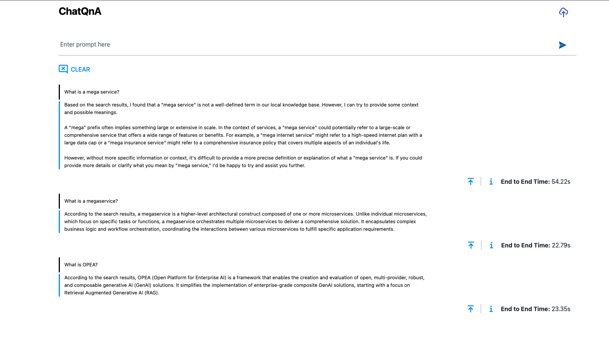

# OPEA ChatQnA AWS Deployment

This repository contains Terraform code to deploy [OPEA's ChatQnA application on AWS](https://opea-project.github.io/latest/getting-started/README.html). The deployment follows the official OPEA documentation and automates the provisioning of infrastructure and application deployment using terraform as infrastructure as code (IaC).

## Prerequisites

- [Terraform](https://www.terraform.io/downloads.html) (v5.0.0 or newer)
- [AWS CLI](https://aws.amazon.com/cli/) installed and configured
- AWS account with appropriate permissions
- SSH key pair on your local machine
- [Hugging Face API Token](https://huggingface.co/settings/tokens) (for model access)

## Project Structure

```
opea-chatqna-deployment/
├── main.tf                # Main Terraform configuration
├── variables.tf           # Input variables
├── outputs.tf             # Output values
├── terraform.tfvars       # Variable values (not committed to git)
├── terraform.tfvars.example # Example variable file (committed to git)
├── modules/               # Terraform modules
│   ├── network/           # Network module (VPC, subnets, etc.)
│   └── ec2/               # EC2 instance module
│       ├── linux-ssh-config.tpl # Template for SSH config
└── README.md              # This file
```

## AWS Provider Version

This project uses the latest AWS provider (version ~> 5.89.0). For documentation on resources and data sources, refer to the [AWS Provider Documentation](https://registry.terraform.io/providers/hashicorp/aws/latest/docs).

## SSH Key Configuration

The deployment automatically:
1. Creates an AWS key pair using your local SSH public key
2. Generates an SSH config snippet to make connecting to the instance easier
3. Uses your SSH private key for commands that connect to the instance

> See generating ssh key pairs [here](./ssh.md)

## Terraform Commands

Initialize the Terraform working directory:

```bash
terraform init
```

Validate the Terraform files:

```bash
terraform validate
```

Format the Terraform files:

```bash
terraform fmt -recursive
```

Generate an execution plan:

```bash
terraform plan
```

Apply the changes:

```bash
terraform apply --auto-approve
```

To destroy the infrastructure:

```bash
terraform destroy --auto-approve
```

## Security Considerations

- Sensitive variables should be stored in a `terraform.tfvars` file which should NOT be committed to version control.
- The `terraform.tfvars` file is included in `.gitignore` to prevent accidental commits.
- A `terraform.tfvars.example` file is provided as a template but contains no sensitive information.
- Consider using AWS Secrets Manager or Parameter Store for storing sensitive information in production environments.
- The Terraform state contains sensitive information - consider using remote state with encryption.

## Variables Configuration

1. Copy the example variable file to create your own variable file:

```bash
cp terraform.tfvars.example terraform.tfvars
```

2. Edit the `terraform.tfvars` file to provide your specific values:

```hcl
aws_region           = "us-east-1"        # Your preferred AWS region
instance_type        = "m7i.4xlarge"      # Recommended for OPEA ChatQnA
ssh_public_key_path  = "~/.ssh/id_rsa.pub" # Path to your SSH public key
ssh_private_key_path = "~/.ssh/id_rsa"    # Path to your SSH private key
huggingface_token    = "your-huggingface-token" # Your Hugging Face API token
```

**Note:** Never commit `terraform.tfvars` to version control as it may contain sensitive information.

## Deployment Steps

1. Navigate to this directory
2. Create your `terraform.tfvars` file as described above
3. Run `terraform init` to initialize the working directory
4. Run `terraform validate` to validate the configuration
5. Run `terraform plan` to see the execution plan
6. Run `terraform apply` to create the infrastructure
7. Use the generated SSH config to connect to the instance: `cat ./ssh_config_opea-chatqna.txt | bash`
8. Access the ChatQnA application via the public IP displayed in the outputs
9. When finished, run `terraform destroy -auto-approve` to tear down the infrastructure

## Troubleshooting

If you encounter issues during deployment:

1. Check the cloud-init logs on the EC2 instance:
   ```bash
   ssh ubuntu@<instance-ip> 'sudo cat /var/log/cloud-init-output.log'
   ```

2. Check the Docker logs for specific services:
   ```bash
   ssh ubuntu@<instance-ip>
   docker logs vllm-service
   ```

3. Ensure your Hugging Face token has the appropriate permissions

4. If you can't connect via SSH, make sure:
   - The paths to your SSH keys are correct in terraform.tfvars
   - Your SSH keys have the correct permissions (chmod 600 for private key)
   - The security group allows SSH access from your IP address 

5. With a successful deployment browse to `http://{public_ip}` i.e `http://3.237.196.198/`

