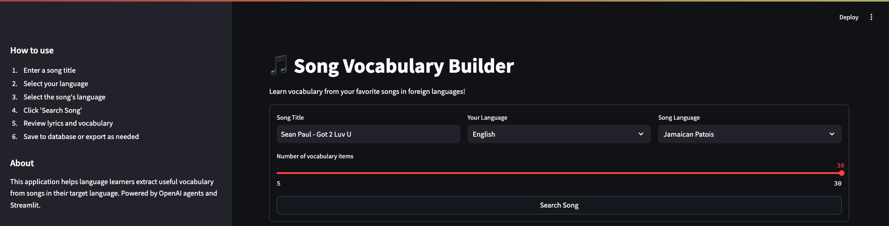
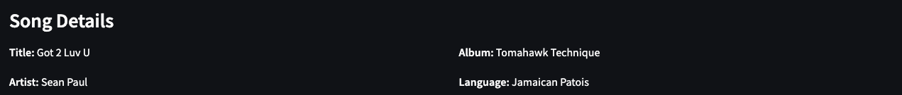
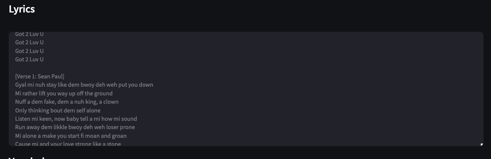
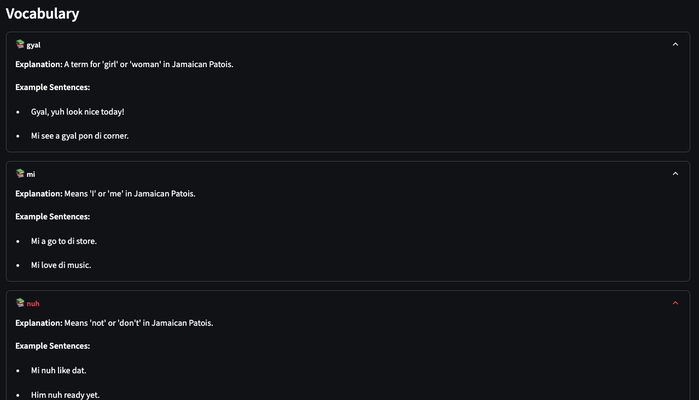
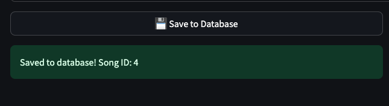
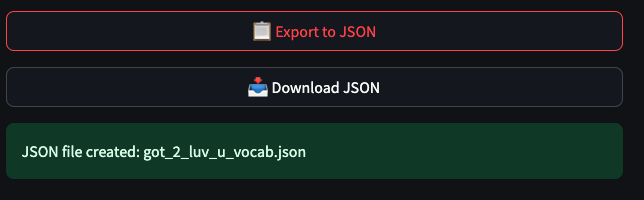

# Song Vocab Application

A web application that helps users learn vocabulary from song lyrics in foreign languages. The application uses OpenAI agents ([web search tool](https://platform.openai.com/docs/guides/tools-web-search?api-mode=responses) and [Function calling](https://platform.openai.com/docs/guides/function-calling?api-mode=responses)) to search for song lyrics and generate vocabulary explanations.

## Project Overview

This application allows users to:
1. Search for songs in their target learning language
2. Get vocabulary explanations from the lyrics
3. See example sentences using the vocabulary
4. Save the data for future reference or export it as JSON

## Technical Implementation Steps

### Step 1: Database and Data Models Setup

The application uses SQLite3 for data storage and Pydantic for data validation. 

#### Database Schema

**Song Table**
- Song Title
- Song Lyrics 
- Song Language
- Song Artist
- Song Album
- Song Release Date

**Vocabulary Table**
- Song ID (foreign key to Song table)
- Vocabulary
- Vocabulary Explanation
- Example Sentences

#### Testing the Database

To test the database implementation:

```bash
# Create a virtual environment
python -m venv venv

# Activate the virtual environment
# On Windows:
venv\Scripts\activate
# On macOS/Linux:
source venv/bin/activate

# Install dependencies
pip install -r requirements.txt

# Run the test script
python tests/test_database.py
```

The test script validates database operations like creating tables, adding songs, and retrieving vocabulary.

### Step 2: OpenAI Agents Integration

This step implements OpenAI agents that power the application:

1. **Web Search Agent**: Searches the internet for song lyrics using OpenAI's web search tool
2. **Vocabulary Generator**: Creates vocabulary explanations and example sentences

These agents use the OpenAI responses API with structured output (JSON schema) to ensure consistent data format.

#### Testing the Agents

```bash
# Run the agents test script
python tests/test_agents.py
```

This verifies that the agents can properly search for songs and generate vocabulary from lyrics.

### Step 3: Streamlit User Interface

The final component is a user-friendly web interface built with Streamlit that ties everything together.

#### Features
- Input form for song title and language preferences
- Display of song lyrics and details
- Vocabulary list with explanations and example sentences
- Options to save to database or export to JSON

#### Screenshots

**Main Search Interface**

*The main interface allows users to enter a song title and select language preferences*

**Song Details and Lyrics**
*After searching, the application displays song details and lyrics*





**Vocabulary Items**
*Generated vocabulary items with explanations and example sentences*



**Export and Save Options**
*Users can save results to the database or export as JSON*





#### Running the Application

```bash
# Ensure dependencies are installed
pip install -r requirements.txt

# Run the Streamlit application
streamlit run app/main.py

# Access the application in your browser
# http://localhost:8501
```

## Project Structure

```
song-vocab/
├── app/ # Streamlit application
│ ├── init.py
│ ├── main.py # Main Streamlit application
│ └── styles/ # CSS styling
│ └── main.css
├── agents/ # OpenAI agents implementation
│ ├── init.py
│ ├── schemas.py # Pydantic schemas for the agents
│ ├── web_search.py # Web search agent
│ └── vocab_gen.py # Vocabulary generator
├── database/ # Database implementation
│ ├── init.py
│ ├── models.py # Pydantic models
│ ├── schema.py # SQL schema creation
│ └── store.py # CRUD operations
├── tests/ # Test scripts
│ ├── test_database.py
│ └── test_agents.py
├── utils/ # Utility functions
├── data/ # Database and exports
│ ├── song_vocab.db # SQLite database
│ └── json_exports/ # Exported JSON files
├── screenshots/ # Application screenshots for documentation
├── init.py # Root package initialization
├── requirements.txt # Project dependencies
├── .env # Environment variables (not in version control)
├── tech_specs.md # Technical specifications
└── README.md # Project documentation
```
