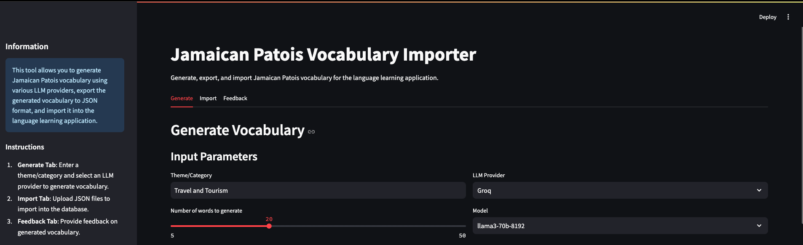
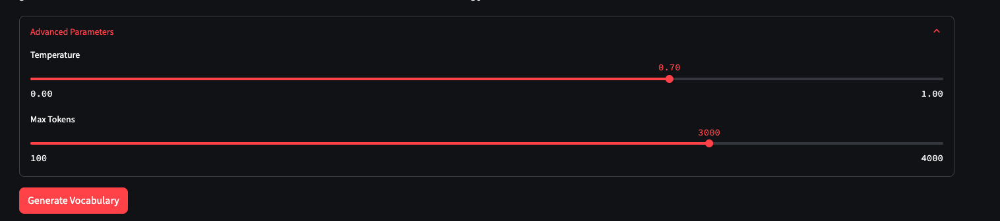
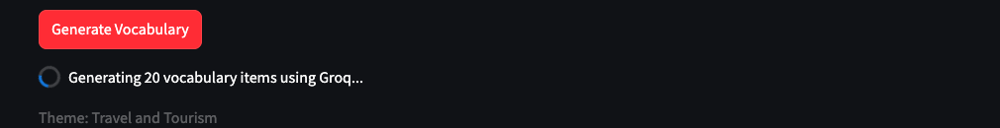
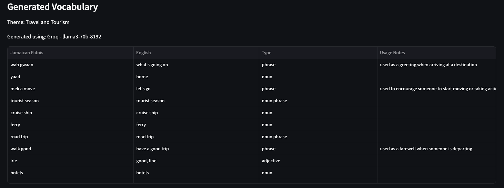
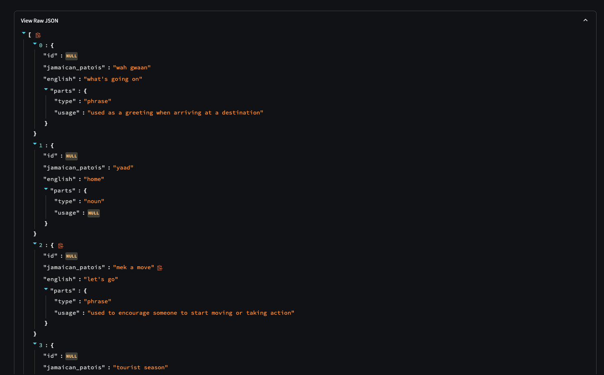
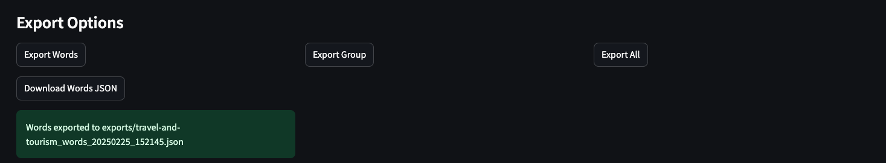

# Vocabulary Importer Tool

A Streamlit-based tool for generating Jamaican Patois vocabulary using various LLM providers, exporting to JSON, and importing into the language learning application.

## Setup Instructions

### Environment Setup

1. Create a virtual environment:
```bash
# Navigate to the vocab-importer directory
cd vocab-importer

# Create a virtual environment
python -m venv venv

# Activate the virtual environment
# On Windows:
venv\Scripts\activate
# On macOS/Linux:
source venv/bin/activate
```

2. Install dependencies:
```bash
# Install required packages
pip install streamlit python-dotenv pandas
pip install openai anthropic groq boto3
```

3. Configure API keys:
Create a `.env` file in the project root with your API keys:
```
OPENAI_API_KEY=your_openai_key_here
ANTHROPIC_API_KEY=your_anthropic_key_here
GROQ_API_KEY=your_groq_key_here
AWS_ACCESS_KEY_ID=your_aws_access_key
AWS_SECRET_ACCESS_KEY=your_aws_secret_key
AWS_REGION=your_aws_region
```

### Running the Application

```bash
streamlit run app.py
```

## User Guide

### Generate Tab

The Generate tab allows you to create Jamaican Patois vocabulary based on a theme or category using various LLM providers.

#### Step 1: Enter Theme and Parameters

1. Enter a theme or category in the "Theme/Category" field (e.g., "Food", "Travel", "Greetings").
2. Adjust the number of words to generate using the slider.
3. Select an LLM provider from the dropdown menu:
   - OpenAI
   - Anthropic
   - Groq
   - AWS Bedrock
4. Select a specific model for the chosen provider.


*Screenshot: Generate tab with input parameters*

#### Step 2: Advanced Parameters (Optional)

Click on "Advanced Parameters" to adjust:
- Temperature: Controls the creativity of the generated vocabulary (higher values = more creative)
- Max Tokens: Controls the maximum length of the response


*Screenshot: Advanced parameters expanded*

#### Step 3: Generate Vocabulary

Click the "Generate Vocabulary" button to start the generation process. The tool will connect to the selected LLM provider and generate vocabulary items based on your parameters.


*Screenshot: Generation in progress with spinner*

#### Step 4: View Generated Vocabulary

Once generation is complete, the vocabulary items will be displayed in a table showing:
- Jamaican Patois word/phrase
- English translation
- Type (part of speech)
- Usage notes (if available)

You can also view the raw JSON data by expanding the "View Raw JSON" section.


*Screenshot: Table of generated vocabulary items*


*Screenshot: Raw JSON view expanded*

#### Step 5: Export Vocabulary

You have three export options:

1. **Export Words**: Exports only the vocabulary items to a JSON file.
2. **Export Group**: Exports the theme/category as a group to a JSON file.
3. **Export All**: Exports vocabulary items, group, and word-group associations as a ZIP file containing all three JSON files.


*Screenshot: Export buttons and download options*

The exported files follow this naming convention:
- Words: `{theme-slug}_words_{timestamp}.json`
- Group: `{theme-slug}_group_{timestamp}.json`
- Associations: `{theme-slug}_word_groups_{timestamp}.json`
- ZIP archive: `{theme-slug}_{timestamp}.zip`

### Import Tab

The Import tab allows you to upload previously exported JSON files. This functionality will be implemented in a future phase.

### Feedback Tab

The Feedback tab allows you to rate and provide comments on the generated vocabulary. This helps improve the quality of future generations.

## Features

- Generate Jamaican Patois vocabulary based on themes/categories
- Choose from multiple LLM providers (OpenAI, Anthropic, Groq, AWS Bedrock)
- Export vocabulary to JSON format
- Import JSON files into the language learning application
- Provide feedback on generated vocabulary

## Project Structure

```
vocab-importer/
├── app.py                 # Main entry point
├── requirements.txt       # Dependencies
├── .env                   # API keys (gitignored)
├── .gitignore
├── README.md
├── llm/                   # LLM integration modules
│   ├── __init__.py
│   ├── openai.py
│   ├── anthropic.py
│   ├── groq.py
│   └── bedrock.py
├── data/                  # Data handling modules
│   ├── __init__.py
│   ├── schema.py          # Data validation
│   ├── export.py          # Export functionality
│   └── import.py          # Import functionality
├── utils/                 # Utility functions
│   ├── __init__.py
│   └── helpers.py
└── feedback/              # Feedback handling
    ├── __init__.py
    └── store.py
```

## Adding Screenshots

To complete the documentation, add screenshots of the application to the `screenshots` directory and update the image paths in this README. 