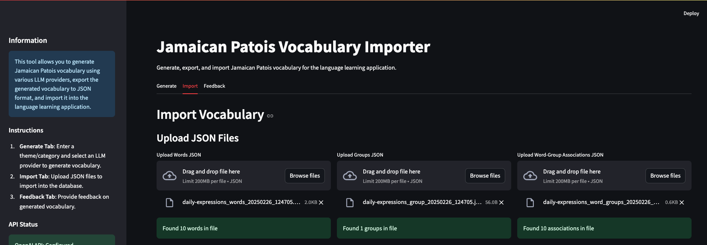
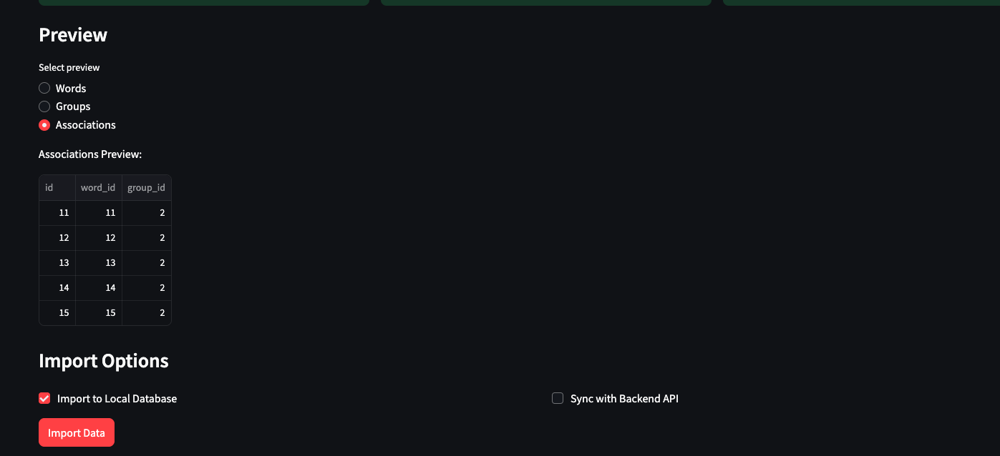
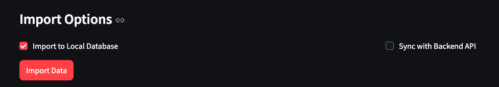
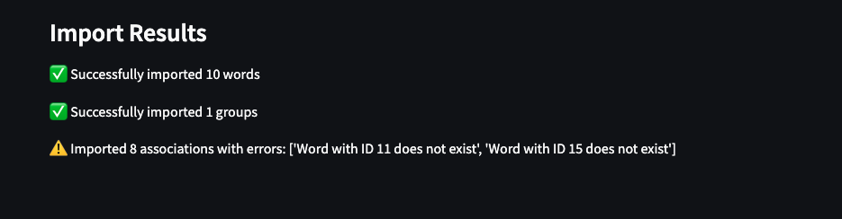
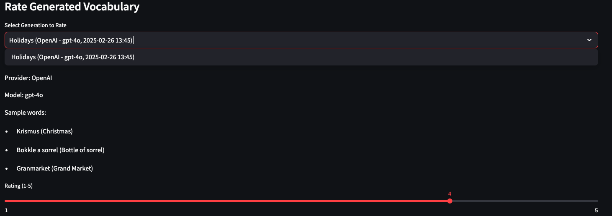
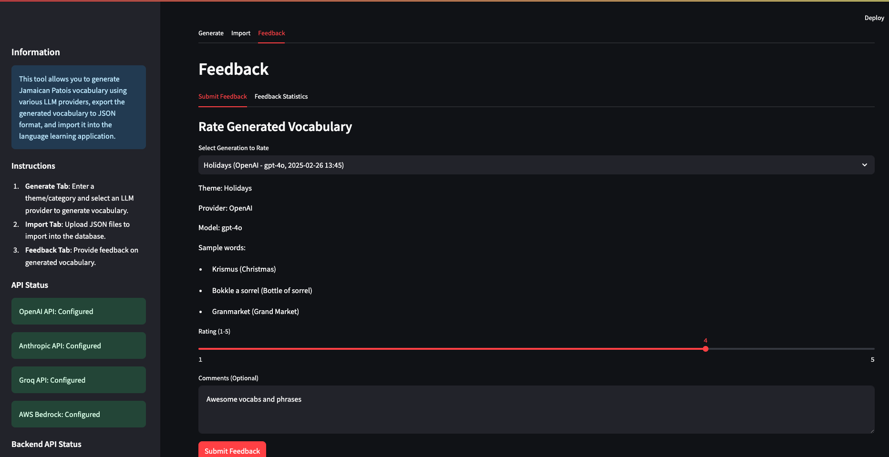
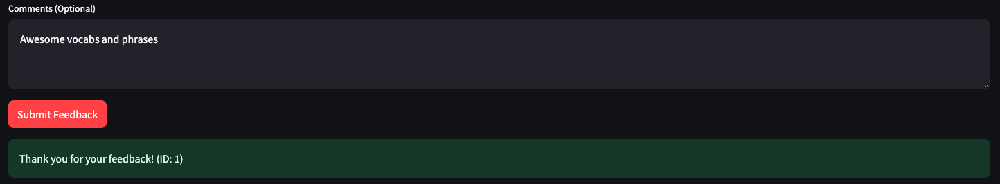
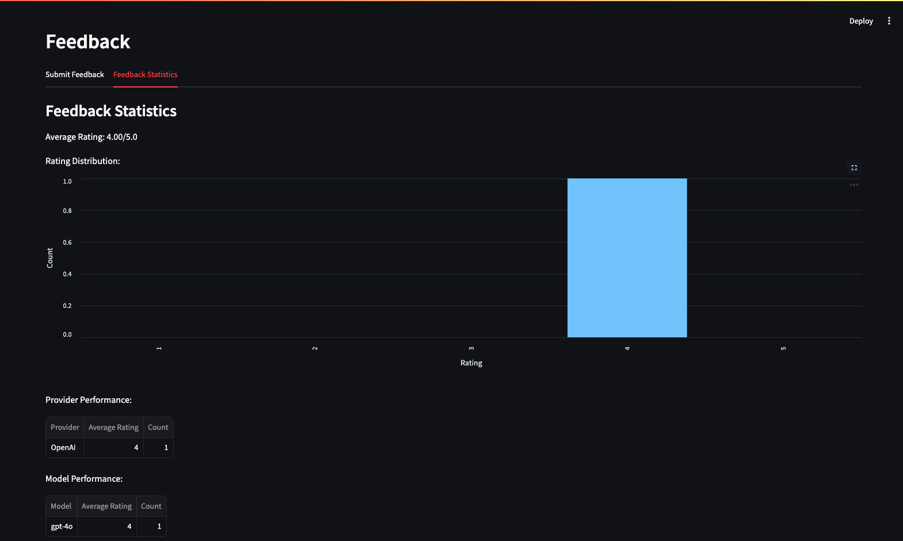

# Vocabulary Importer Tool

A Streamlit-based tool for generating Jamaican Patois vocabulary using various LLM providers, exporting to JSON, and importing into the language learning application.

## Setup Instructions

### Environment Setup

1. Create a virtual environment:
```bash
# Navigate to the vocab-importer directory
cd vocab-importer

# Create a virtual environment
python -m venv venv

# Activate the virtual environment
# On Windows:
venv\Scripts\activate
# On macOS/Linux:
source venv/bin/activate
```

2. Install dependencies:
```bash
# Install required packages
pip install -r requirements.txt
```

3. Configure API keys:
Create a `.env` file in the project root with your API keys (use `.env.example` as a template):
```
# API Keys
OPENAI_API_KEY=your_openai_key_here
ANTHROPIC_API_KEY=your_anthropic_key_here
GROQ_API_KEY=your_groq_key_here
AWS_ACCESS_KEY_ID=your_aws_access_key
AWS_SECRET_ACCESS_KEY=your_aws_secret_key
AWS_REGION=your_aws_region

# Database
DATABASE_PATH=data/db/vocabulary.db

# Backend API
API_URL=http://localhost:8000/api
API_KEY=your_api_key_here
```

### Running the Application

```bash
streamlit run app.py
```

## User Guide

### Generate Tab

The Generate tab allows you to create Jamaican Patois vocabulary based on a theme or category using various LLM providers.

#### Step 1: Enter Theme and Parameters

1. Enter a theme or category in the "Theme/Category" field (e.g., "Food", "Travel", "Greetings").
2. Adjust the number of words to generate using the slider.
3. Select an LLM provider from the dropdown menu:
   - OpenAI
   - Anthropic
   - Groq
   - AWS Bedrock
4. Select a specific model for the chosen provider.


*Screenshot: Generate tab with input parameters*

#### Step 2: Advanced Parameters (Optional)

Click on "Advanced Parameters" to adjust:
- Temperature: Controls the creativity of the generated vocabulary (higher values = more creative)
- Max Tokens: Controls the maximum length of the response


*Screenshot: Advanced parameters expanded*

#### Step 3: Generate Vocabulary

Click the "Generate Vocabulary" button to start the generation process. The tool will connect to the selected LLM provider and generate vocabulary items based on your parameters.


*Screenshot: Generation in progress with spinner*

#### Step 4: View Generated Vocabulary

Once generation is complete, the vocabulary items will be displayed in a table showing:
- Jamaican Patois word/phrase
- English translation
- Type (part of speech)
- Usage notes (if available)

You can also view the raw JSON data by expanding the "View Raw JSON" section.


*Screenshot: Table of generated vocabulary items*


*Screenshot: Raw JSON view expanded*

#### Step 5: Export Vocabulary

You have three export options:

1. **Export Words**: Exports only the vocabulary items to a JSON file.
2. **Export Group**: Exports the theme/category as a group to a JSON file.
3. **Export All**: Exports vocabulary items, group, and word-group associations as a ZIP file containing all three JSON files.


*Screenshot: Export buttons and download options*

The exported files follow this naming convention:
- Words: `{theme-slug}_words_{timestamp}.json`
- Group: `{theme-slug}_group_{timestamp}.json`
- Associations: `{theme-slug}_word_groups_{timestamp}.json`
- ZIP archive: `{theme-slug}_{timestamp}.zip`

### Import Tab

The Import tab allows you to upload previously exported JSON files and import them into the local database or sync them with the backend API.

#### Step 1: Upload JSON Files

Upload one or more of the following JSON files:
- Words JSON: Contains vocabulary items
- Groups JSON: Contains theme/category information
- Word-Group Associations JSON: Contains the relationships between words and groups


*Screenshot: Import tab with file upload sections*

#### Step 2: Preview Data

After uploading files, you can preview the data before importing. Select the data type you want to preview using the radio buttons.


*Screenshot: Preview of uploaded data*

#### Step 3: Select Import Options

Choose where to import the data:
- **Import to Local Database**: Imports the data into the local SQLite database
- **Sync with Backend API**: Sends the data to the backend API for synchronization


*Screenshot: Import options checkboxes*

#### Step 4: Import Data

Click the "Import Data" button to start the import process. The tool will display the results of the import operation, including any errors that occurred.


*Screenshot: Results of the import operation*

### Feedback Tab

The Feedback tab allows you to rate and provide comments on the generated vocabulary. This helps improve the quality of future generations.

#### Step 1: Select Generation to Rate

Choose which vocabulary generation you want to rate from the dropdown menu. The tool keeps track of your recent generations.


*Screenshot: Selecting a generation to rate*

#### Step 2: Provide Rating and Comments

1. Use the slider to rate the quality of the generated vocabulary from 1 to 5.
2. Optionally, provide comments or suggestions in the text area.


*Screenshot: Feedback form with rating and comments*

#### Step 3: Submit Feedback

Click the "Submit Feedback" button to store your feedback. The feedback is stored in the local database and can be used to improve future generations.


*Screenshot: Confirmation of submitted feedback*

#### Step 4: View Feedback Statistics

Switch to the "Feedback Statistics" tab to view aggregated feedback data, including:
- Average rating across all generations
- Rating distribution
- Provider performance
- Model performance
- Popular themes


*Screenshot: Feedback statistics dashboard*

You can also export all feedback data to a JSON file for further analysis.

## Features

- Generate Jamaican Patois vocabulary based on themes/categories
- Choose from multiple LLM providers (OpenAI, Anthropic, Groq, AWS Bedrock)
- Export vocabulary to JSON format
- Import JSON files into the local database
- Sync data with the backend API
- Provide feedback on generated vocabulary

## Database Integration

The tool uses a SQLite database to store vocabulary data locally. The database schema includes:

- **words**: Stores vocabulary items with their translations and metadata
- **groups**: Stores theme/category information
- **word_groups**: Stores the relationships between words and groups

When exporting or importing data, the tool checks for existing records to avoid duplicates and manages IDs to prevent conflicts.

## Backend API Integration

The tool can connect to a backend API to synchronize data. The API endpoints include:

- `/health`: Check API connection
- `/words/sync`: Sync vocabulary items
- `/groups/sync`: Sync theme/category information
- `/word_groups/sync`: Sync word-group associations

## Project Structure

```
vocab-importer/
├── app.py                 # Main entry point
├── requirements.txt       # Dependencies
├── .env                   # API keys (gitignored)
├── .env.example           # Template for .env file
├── .gitignore
├── README.md
├── llm/                   # LLM integration modules
│   ├── __init__.py
│   ├── openai.py
│   ├── anthropic.py
│   ├── groq.py
│   └── bedrock.py
├── data/                  # Data handling modules
│   ├── __init__.py
│   ├── schema.py          # Data validation
│   ├── export.py          # Export functionality
│   ├── importer.py        # Import functionality
│   └── database.py        # Database operations
├── api/                   # API integration
│   └── client.py          # API client
├── utils/                 # Utility functions
│   ├── __init__.py
│   └── helpers.py
└── feedback/              # Feedback handling
    ├── __init__.py
    └── store.py
```